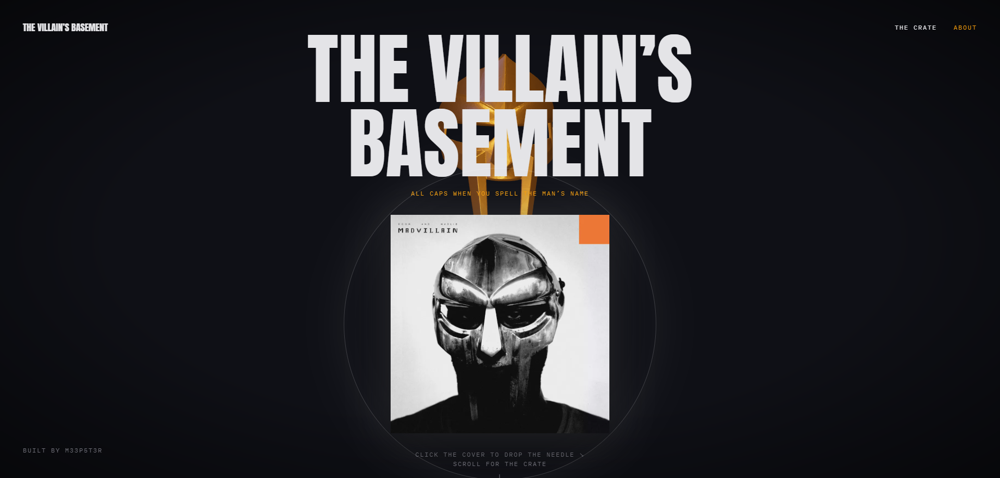

# THE VILLAIN'S BASEMENT

**An interactive vinyl tribute to MF DOOM — and a deep-dive into audio-reactive 3D on the web.**

🔴 **Live:** [happy-birthday-doom.vercel.app](https://happy-birthday-doom.vercel.app/)

> *ALL CAPS WHEN YOU SPELL THE MAN'S NAME.*

---

## What This Is

A single-purpose web experience honoring Daniel Dumile (1971–2020). You descend into the villain's basement, dig through a crate of his records, pull one out, and drop the needle — the entire 3D scene comes alive to the music.

It's also a portfolio piece. Every interaction pattern here — scroll-driven 3D browsing, authored animation timelines, real-time audio analysis driving the render loop — was built from scratch to demonstrate what's possible when React Three Fiber is treated as a craft, not a template.

## The Experience

**HERO** — The mask. A real photogrammetry scan floating in the dark, lit from below, swaying on a 6-second idle loop.

**THE CRATE** — Scroll to dig through fanned record sleeves: *Operation: Doomsday*, *Madvillainy*, *Mm.. Food*, *Key to the Kuffs*. Comic-book tooltips point the way, then get out of yours.

**THE LIFT** — Click a sleeve and it rises out of the crate on a bezier arc while the rest sink away. The room's entire color palette crossfades to that album's mood — the color deliberately trails the motion.

**THE REVEAL** — The sleeve slides aside, the vinyl slips out from behind it and spins up to 33⅓. The detail panel cuts in, and the clip starts the moment it lands.

**PLAYING** — Bass scales the halftone dot field and wobbles the vinyl. Kicks flash the vignette. Mids drive the waveform. The mask, faint in the background fog, nods along.

Every transition has a hand-tuned reverse — exits run 15% faster than entries, because leaving should never feel like a rewind.

## Audio-Reactive Architecture

A Web Audio `AnalyserNode` splits the signal into bass / mid / treble bands each frame, feeding a single shared analyzer consumed across the app:

| Band | Drives |
|------|--------|
| Bass | Mask scale (1.00–1.04) · halftone dot scale · vinyl wobble ±0.3° · spotlight breathing |
| Kick | Vignette flash (120ms decay) · accent frame pulse |
| Mids | Mask emissive shimmer · waveform bars |
| Treble | Head-nod jitter · sheen sweep |

The reactive layer writes to refs and CSS variables inside `requestAnimationFrame` — **zero React re-renders** during playback.

## Engineering Highlights

- **Section state machine** (`hero → crate → sleeve → playing`) in Zustand, with transitions authored as Theatre.js sheets — exact durations and cubic-beziers, deterministic and reversible.
- **Viewport-derived 3D layout** — the sleeve/vinyl composition computes its position from the live camera frustum every frame, so the split-screen contract holds from laptop to ultrawide.
- **Persistent mask** — one 3D object anchored per-section with scroll parallax and depth fog, never fighting the foreground UI.
- **Canvas-generated vinyl labels** — each album's label (title / 33⅓ RPM / year) is drawn to a `CanvasTexture` at runtime in the album's accent color.
- **Typography discipline** — 3D objects and color animate; type *cuts*. Text never moves while readable.
- **Reduced motion** respected throughout: moves become fades, parallax and sway disabled.

## Stack

| Layer | Tech |
|-------|------|
| Framework | Next.js 16 · React 19 |
| 3D | React Three Fiber 9 · drei · three r185 |
| Animation | Theatre.js |
| State | Zustand |
| Audio | Web Audio API (custom analyzer) |
| Styling | Tailwind CSS 4 |
| Type | Anton · Bangers · Karla · IBM Plex Mono |

## Process

The interaction pattern was reverse-engineered from a reference vinyl-player concept by frame-extracting its demo video with ffmpeg and mapping the state/transition choreography. That became a written design brief → high-fidelity mockups → a full refactor spec with per-file mappings and commit-sized phases → guided implementation. Design decisions were locked before code was written.

## On the Music

Audio is limited to short excerpts (~15–20s), clearly labeled as fair-use clips, in tribute context with full attribution. All rights to the recordings belong to their respective holders — go stream the albums in full:

**Operation: Doomsday** (1999) · **Madvillainy** (2004) · **Mm.. Food** (2004) · **Key to the Kuffs** (2012)

## Source Access

This repository is a public showcase. Full source is available on request — reach out via GitHub.

---

**BUILT BY M33P5T3R** · Rest in power, DOOM. 🎭
